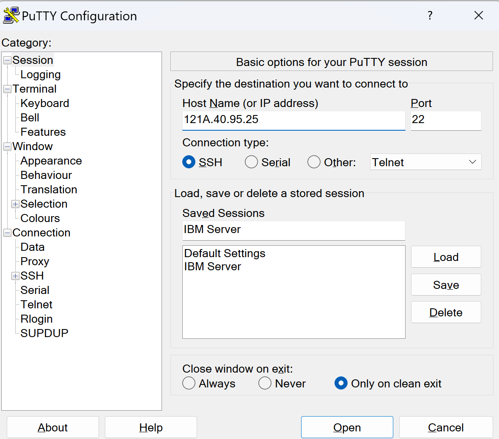

# How to install CUDA on IBM Red Hat Linux OpenPower AC922  for Generative AI Training.

Hello everyone, today  we are going to install a CUDA driver on a Server
POWER9 that is a family of superscalar, multithreading, multi-core microprocessors produced by IBM, based on the Power ISA.

This system is one of the fatest HPC computhers that IBM has been developed. Was the seventh fastest supercomputer in the world (based on the Top500 list as of November 2023), is based on POWER9, while also using Nvidia Tesla GPUs as accelerators.

*Figure 1. Power AC922 server model GTH fully populated with four GPUs*

Due to the importance of the **Training** and **Fine-Tunning** of Large Languange Models (LLMs) we want to setup a this server and perform simple transformations of a dataset and perform fine tuning of a custom LLM.


## Step 1 - VPN Connection

In ordering to connect to the IBM server we need to connect to VPN of the IBM intranet. Once you are connected to the intranet with the appropiate credentials you can proceed. For futher information visit the official documentation [here](https://github.com/IBM/itz-support-public/blob/main/IBM-On-premise/IBM-On-premise-Runbooks/configure-vpn.md).

## Step 2- Reserve your Instance

Once you are in the intranet and you have your server Power9 running.
You need to setup the ssh connection.
### Windows ssh connection
1. Download Putty [here](https://www.putty.org/).
2. Then you need to download your private key that was provided to you to connect to the server , then you save your User Private SSH Key, for example with the name  `private.pem`  

3. Then you open PuTTY Key Generator and  click on load. 

onece you click load and choosed you private key


4. click save and name for exmaple `private.ppk`
5. Then open your putty and add the IP Address of your server
   
6. Go to Connection>Data and put there your `username` provided
 
7. Go to SSH > Auth > Credentials, and click Browse.
8. Select the private key you created in the preceding section.
9. Go to Session give name  like `IBM Server` and click Save.
10. Click open

when you will connected you will get something like this


## Step 2 Pre-installation Actions

Verify You Have a CUDA-Capable GPU


```
lspci | grep -i nvidia
```


Verify You Have a Supported Version of Linux

```
uname -m && cat /etc/*release
```


this system uses ppc64le which is a pure little-endian mode that has been introduced with the POWER8 as the prime target for technologies provided by the OpenPOWER Foundation.

### Installl GCC


To install GCC (GNU Compiler Collection) on Red Hat Enterprise Linux 8.9 with a ppc64le system, you can use the package manager `yum` or `dnf`. Here's how you can do it:


1. Update your package manager's repository information by running:

```
sudo dnf update
```

and type Y, after is updated you got

1. Install GCC by running the following command:

```
sudo dnf install gcc
```

3. Enter your password when prompted, and then confirm the installation by typing 'y' and pressing Enter.


4. Once the installation is complete, you can verify the installation by checking the GCC version:

```
gcc --version
```

This command should display the installed GCC version.

That's it! GCC is now installed on your Red Hat Enterprise Linux 8.9 system with a ppc64le architecture. You can use it to compile C, C++, and other supported programming languages.

##   Installation CUDA
Here is a step-by-step guide to installing CUDA on a Power9 system with Red Hat 8 (RHEL 8):

**Step 1: Enable the EPEL repository**

To enable the EPEL repository, you need to create a new file called `epel.repo` in the `/etc/yum.repos.d/` directory.


```
sudo vi /etc/yum.repos.d/epel.repo
```
This will create a new file called `epel.repo` in the `/etc/yum.repos.d/` directory. Add the following contents to the file:
```markdown
[epel]
name=epel
baseurl=http://download.fedoraproject.org/pub/epel/8/Everything/ppc64le/
enabled=1
gpgcheck=0
```
Save and exit the file by pressing `:wq` and then `Enter`.

Then run the following command to update the repository cache:
```
sudo yum update
```
**Step 2: Enable the CUDA repository**

To enable the CUDA repository, you need to create a new file called `cuda-rhel8.repo` in the `/etc/yum.repos.d/` directory.

Run the following command to open the file in the `vi` editor with superuser privileges:
```
sudo vi /etc/yum.repos.d/cuda-rhel8.repo
```
This will create a new file called `cuda-rhel8.repo` in the `/etc/yum.repos.d/` directory. Add the following contents to the file:
```markdown
[cuda-rhel8]
name=cuda-rhel8
baseurl=https://developer.download.nvidia.com/compute/cuda/repos/rhel8/ppc64le/
enabled=1
gpgcheck=0
```
Save and exit the file by pressing `:wq` and then `Enter`.
Then run the following command to update the repository cache:
```
sudo yum update
```
**Step 3: Configure the ks.cfg file**

The `ks.cfg` file is usually located in  `/home/<username>/` directory. 
Open open a file
```
vi ks.cfg
```
Add the following line to the `packages` section:
```
@nvidia-driver:latest-dkms/ks
```
Save and exit the file by pressing `:wq` and then `Enter`.

**Step 4: Download the CUDA installer**

The CUDA Toolkit can be installed using either of two different installation mechanisms: distribution-specific packages (RPM packages), or a distribution-independent package (runfile packages).


You need to download the CUDA installer from the NVIDIA website. Go to the [NVIDIA CUDA download page](https://developer.nvidia.com/cuda-downloads) and select the correct version for your system (Red Hat Enterprise Linux 8.9 with a ppc64le system).


```
wget https://us.download.nvidia.com/tesla/550.54.15/nvidia-driver-local-repo-rhel8-550.54.15-1.0-1.ppc64le.rpm
```


Method 1 - Run File
```
wget https://developer.download.nvidia.com/compute/cuda/12.4.1/local_installers/cuda_12.4.1_550.54.15_linux_ppc64le.run

```

```
sudo sh cuda_12.4.1_550.54.15_linux_ppc64le.run
```


Method 2 - RPM Network
To install the legacy kernel module flavor:

```
sudo dnf clean all
```


```
sudo dnf -y module install nvidia-driver:latest-dkms
```


```
sudo dnf config-manager --add-repo https://developer.download.nvidia.com/compute/cuda/repos/rhel8/ppc64le/cuda-rhel8.repo
```

```
sudo dnf clean all
```

```
sudo dnf -y install cuda-toolkit-12-4
```


```
sudo dnf clean all
sudo dnf -y install cudnn
To install for CUDA 12, perform the above configuration but install the CUDA 12 specific package:

```
sudo dnf -y install cudnn-cuda-12


Go to http://www.nvidia.com/Download/index.aspx

Select the options that match your GPU, operating system and computer architecture. While the CUDA toolkit is not required to be installed, there may be a prompt referring to the toolkit during the NVIDIA driver installation. If prompted, select 10.0 for CUDA toolkit.

Install the driver.

Post-driver steps for POWER9 only. Skip to step 5 if you are not installing the DLE on a POWER9 system.

The following instructions can also be found in the NVIDIA CUDA Toolkit documentation:

a. The NVIDIA Persistence Daemon should be automatically started for POWER9 installations. Check that it is running with the following command:

  # systemctl status nvidia-persistenced
If it is not active, run the following command:

  # sudo systemctl enable nvidia-persistenced


**Running the CUDA installer**

Open a terminal and run the following command to run the CUDA installer with superuser privileges:
```
sudo sh cuda_<version>_linux.run
```
Replace `<version>` with the actual version number of the CUDA installer you downloaded.

Follow the on-screen prompts to accept the EULA, install the CUDA Driver, and install the CUDA Toolkit, specifying the location and creating a symbolic link at `/usr/local/cuda`.


**Step 6: Perform post-installation actions**

**Create a blacklist file for Nouveau**

Create a file at `/etc/modprobe.d/blacklist-nouveau.conf` with the following contents:
```
blacklist nouveau
options nouveau modeset=0
```
**Regenerate the kernel initramfs**

Run the following command:
```
sudo dracut --force
```
That's it! You should now have CUDA installed on your Power9 system with Red Hat Enterprise Linux 8.9.


Here is the step-by-step guide to install PyTorch on a PowerPC 64-bit little-endian architecture Red Hat Enterprise Linux 8.9 with a ppc64le system:

**Prerequisites:**

* Ensure you have a working internet connection.
* Install the necessary development tools and libraries on your system, including `git`, `python3`d `gcc`. You can install them using the following command:
```
sudo dnf install git python3 gcc
```
**Step 1: Clone the PyTorch repository**

* Open a terminal and run the following command to clone the PyTorch repository with the `v1.8.1` branch:
```
git clone -b v1.8.1 https://github.com/pytorch/pytorch.git --depth=1 pytorch_v1.8.1
```
**Step 2: Access the source package and obtain passive dependency code**

* Change into the cloned repository:
```
cd pytorch_v1.8.1
```
* Run the following commands to sync and update the submodules:
```
git submodule sync
git submodule update --init --recursive
```
**Step 3: Configure environment variables**

* Set the `USE_XNNPACK` environment variable to `0`:
```
export USE_XNNPACK=0
```
**Step 4: Compile and install PyTorch**

* Run the following command to compile and install PyTorch:
```
python3 setup.py install
```
This may take some time to complete.

**Step 5: Compile and generate the binary installation package of the PyTorch plugin**

* Clone the PyTorch plugin repository with the `v1.8.1-3.0.0` branch:
```
git clone -b v1.8.1-3.0.0 https://gitee.com/ascend/pytorch.git
```
* Change into the cloned repository:
```
cd pytorch
```
* Specify the Python version packaging mode (in this case, Python 3.10) and run the build script:
```
bash ci/build.sh --python=3.10
```
This will generate the binare of the PyTorch plugin.

**Note:** If you want to install PyTorch 1.11.0, replace `v1.8.1` with `v1.11.0` and `v1.8.1-3.0.0` with `v1.11.0-3.0.0` in the above commands.

**Verification:**

After completing the installation, you can verify that PyTorch has been installed correctly by running:
```
python3 -c "import torch; print(torch.__version__)"
```
This should print the version of PyTorch you just installed.


------------------------
**Step 1: Enable the EPEL repository**

To enable the EPEL repository, create a new file in the `/etc/yum.repos.d/` directory, for example, `sudo vi epel.repo`, with the following contents:
```markdown
[epel]
name=epel
baseurl=http://download.fedoraproject.org/pub/epel/8/Everything/x86_64/
enabled=1
gpgcheck=0
```
Then, save the file and run the following command to update the repository cache:
```
sudo yum update
```
**Step 2: Enable the CUDA repository**

To enable the CUDA repository, create a new file in the `/etc/yum.repos.d/` directory, for example, `sudo vi cuda-rhel8.repo`, with the following contents:
```markdown
[cuda-rhel8]
name=cuda-rhel8
baseurl=https://developer.download.nvidia.com/compute/cuda/repos/rhel8/x86_64/
enabled=1
gpgcheck=0
```
Then, save the file and run the following command to update the repository cache:
```
sudo yum update
```
**Step 3: Configure the ks.cfg file**

In the `ks.cfg` file, make sure you are using the `/ks` profile and the `:latest-dkms` stream. Add the following line to the `packages` section:
```
@nvidia-driver:latest-dkms/ks
```
**Step 4: Perform pre-installation actions**

**Disable Nouveau drivers**

Reboot into text mode (runlevel 3) by adding the number "3" to the end of the system's kernel boot parameters. You may need to temporarily add "nomodeset" to the system's kernel boot parameters to fix display issues.

Consult your system's bootloader documentation for information on how to make the above boot parameter changes.

**Verify Nouveau drivers are not loaded**

Run the following command to verify that the Nouveau drivers are not loaded:
```
lsmod | grep nouveau
```
If the Nouveau drivers are still loaded, consult your distribution's documentation to see if further steps are needed to disable Nouveau.

**Step 5: Run the CUDA installer**

Run the CUDA installer with sufficient privileges:
```
sudo sh cuda_<version>_linux.run
```
Follow the on-screen prompts to:

* Accept the EULA
* Install the CUDA Driver
* Install the CUDA Toolkit, specifying the location and creating a symbolic link at `/usr/local/cuda`

**Step 6: Reboot and verify**

Reboot the system to reload the graphical interface:
```
sudo reboot
```
Verify that the device nodes are created properly.

**Step 7: Perform post-installation actions**

**Create a blacklist file for Nouveau**

Create a file at `/etc/modprobe.d/blacklist-nouveau.conf` with the following contents:
```
blacklist nouveau
options nouveau modeset=0
```
**Regenerate the kernel initramfs**

Run the following command:
```
sudo dracut --force
```
That's it! You should now have CUDA installed on your Power9 system with Red Hat 8 (RHEL 8).


--------------------
Tge current system  Linux OpenPower AC922  has ed Hat Enterprise Linux 8.9
1. Enable the EPEL repository:
```
repo --name=epel --baseurl=http://download.fedoraproject.org/pub/epel/8/Everything/x86_64/

```

---------------------------------

Enable the CUDA repository:

repo --name=cuda-rhel8 --baseurl=https://developer.download.nvidia.com/compute/cuda/repos/rhel8/x86_64/
In the packages section of the ks.cfg file, make sure you are using the /ks profile and :latest-dkms stream:

@nvidia-driver:latest-dkms/ks


## Step 2  - Post-installation Actions

There are two changes that need to be made manually after installing the NVIDIA CUDA driver to ensure proper operation:

The NVIDIA Persistence Daemon should be automatically started for POWER9 installations. Check that it is running with the following command:

systemctl status nvidia-persistenced
If it is not active, run the following command:

sudo systemctl enable nvidia-persistenced
Disable a udev rule installed by default in some Linux distributions that cause hot-pluggable memory to be automatically onlined when it is physically probed. This behavior prevents NVIDIA software from bringing NVIDIA device memory online with non-default settings. This udev rule must be disabled in order for the NVIDIA CUDA driver to function properly on POWER9 systems.

On RedHat Enterprise Linux 8.1, this rule can be found in:

/lib/udev/rules.d/40-redhat.rules
On Ubuntu 18.04, this rule can be found in:

/lib/udev/rules.d/40-vm-hotadd.rules
The rule generally takes a form where it detects the addition of a memory block and changes the ‘state’ attribute to online. For example, in RHEL8, the rule looks like this:

SUBSYSTEM=="memory", ACTION=="add", PROGRAM="/bin/uname -p", RESULT!="s390*", ATTR{state}=="offline", ATTR{state}="online"
This rule must be disabled by copying the file to /etc/udev/rules.d and commenting out, removing, or changing the hot-pluggable memory rule in the /etc copy so that it does not apply to POWER9 NVIDIA systems. For example, on RHEL 7.5 and earlier:

sudo cp /lib/udev/rules.d/40-redhat.rules /etc/udev/rules.d
sudo sed -i '/SUBSYSTEM=="memory", ACTION=="add"/d' /etc/udev/rules.d/40-redhat.rules
On RHEL 7.6 and later versions:

sudo cp /lib/udev/rules.d/40-redhat.rules /etc/udev/rules.d
sudo sed -i 's/SUBSYSTEM!="memory",.*GOTO="memory_hotplug_end"/SUBSYSTEM=="*", GOTO="memory_hotplug_end"/' /etc/udev/rules.d/40-redhat.rules
You will need to reboot the system to initialize the above changes.